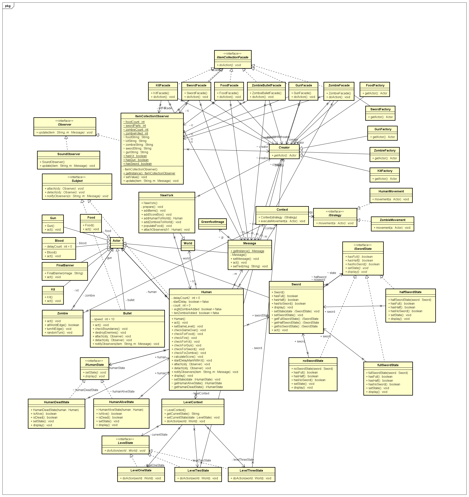

# Fall-18-202-pheonix : "The Walking Dead"

Phoenix team has developed a single player game called "The walking Dead".

## Team members:

Kriti Jar

Ruchika Hazariwal

Harsh Agarwal

Hemaprasanthi Mutyala

## Design Patterns

### State Design Pattern: For game Levels (Kriti Jar)

LevelOneState: Initial level of game. It includes 5 zombies.

LevelTwoState: The number of zombies are 8 in level two. 

LevelThreeState: The number of zombies are 10. Once the zombies are killed Final banner is shown.

### Observer Design Pattern (Kriti Jar)

Subject: Human and Bullet

Observers: ItemCollectionObserver and SoundObserver

Observer pattern keep tracks of all the items which are intersected by human or bullet and notifies the observers.
Ex. When human collects kit, ItemCollectionObserver is notifies that updates the message to 'Kit Available'.

If human, collects the sword, soundObserver is notified that plays the sound in background.

### Facade Pattern: Simplifying ItemCollectionObserver (Ruchika Hazariwal)

The Facade pattern was implemented to simplify the complex ItemCollectionObserver functionalities.
It helped in distributing the task  and providing the simplified interface.

Overall ItemCollectionObserver was simplified to KitFacade, SwordFacade, HumanFacade, ZombieFacade, ZombieBulletFacade.

### State Design Pattern : Human State (Ruchika Hazariwal)
iHumanState

HumanAliveState: Human is alive and if collides zombie then set state to humanDeadState 

HumanDeadState: If human dies, state changes to HumanDeadState.

### State Design Pattern: Sword State (Harsh Agarwal)
iSwordState

NoSwordState: Human doesn't have any sword parts.

HalfSwordState: Human has one part of sword and same is updated to message

FullSwordState: Human has both parts of sword and can kill one zombie.

### Factory Pattern: Creating actors (Harsh Agarwal)

KitFactory: To create kit
ZombieFactory: To create zombie
FoodFactory: To create Food
GunFactory: To create gun
SwordFactory: To create parts of sword

### Strategy Pattern: Human and Zombie movement (Hemaprasanthi Mutyala)
iStrategy
Context

HumanMovement: handle the movement of human
ZombieMovement: handle the movement of Zombie

### Singleton Pattern: Message (Hemaprasanthi Mutyala)

To make sure that single instance of message class is maintained throughout the game.

## XP Values: Communication

The primary value we focused on during our development was communication

We interacted regularly and had scrum meetings on scheduled time.

We made sure that  everyone understands the current status of project and helped each to clear blockers.

During our meetings we took each others feedback positively and worked on them to keep the pace of development going.

## Links:

Source Code: https://github.com/nguyensjsu/fa18-202-pheonix/tree/master/The-Walking-Dead/src

Project Board: https://github.com/nguyensjsu/fa18-202-pheonix/projects/1

Project Journal: https://github.com/nguyensjsu/fa18-202-pheonix/tree/master/ProjectJournal/Scrum%20Report

Google Sprint Task Sheet: https://github.com/nguyensjsu/fa18-202-pheonix/tree/master/ProjectJournal/Scrum%20Report/Task%20board

Ad Video: https://youtu.be/lNh0St9qYlM

Presentation: https://github.com/nguyensjsu/fa18-202-pheonix/tree/master/Presentation

